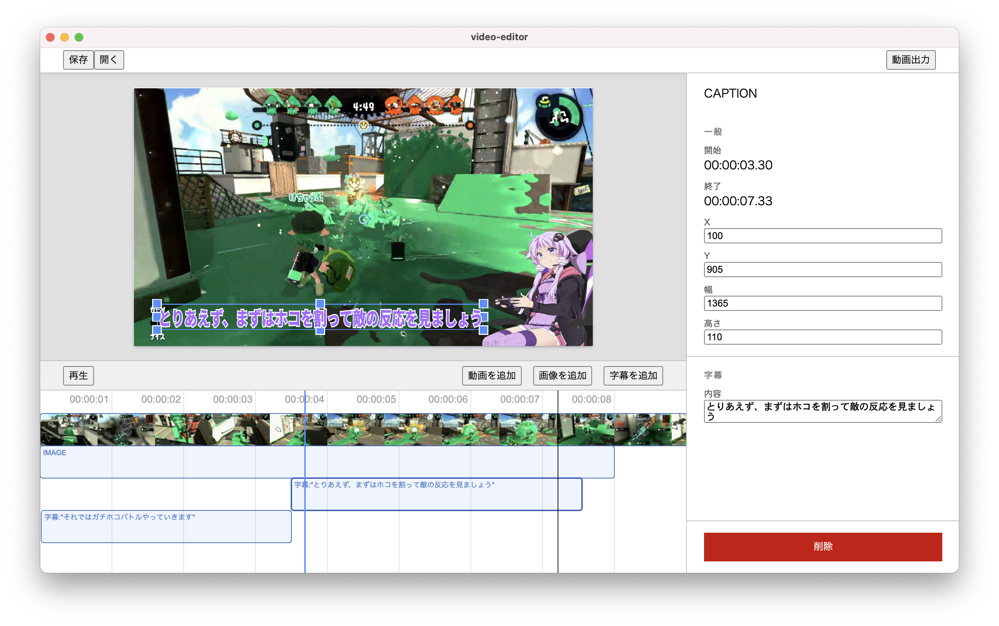

# Video Editor (仮)

動画編集ソフトです。動画に字幕やキャラクターの静止画を合成することができます。

**まだまだ開発中のため利用は自己責任でお願いします**

## 特徴・なぜこのツールを使うべきか

- **分かりやすさ**
  - パワーポイントライクなWYSYWYG UIを採用し、思い描いた動画を直感的に作成できます
- **カスタマイズ性**
  - 既存の動画編集ソフトは機能が豊富ですが、必要な機能はユーザーによって異なり、すべての機能が必要なわけでは有りません
  - 拡張機能ベースにより、ユーザーが必要な機能だけを選択的に付け足せ、UIをシンプルに保てます
- **マルチプラットフォーム**
  - Windows / macOS / LinuxのどのOSからも共通のUIで利用可能

## 使い方

TODO

## 開発に参加するには

ありがとうございます！
現在は設計の方向性がまだまだ不安定な段階なので、直接PRを送ってもらうより、まずはissueで機能提案やバグ報告をしていただけたら嬉しいです。

### ビルド方法

まだ exe / app など実行形式のビルドはできません。とりあえず起動したい場合は `npm install && npm run start` でできます。
